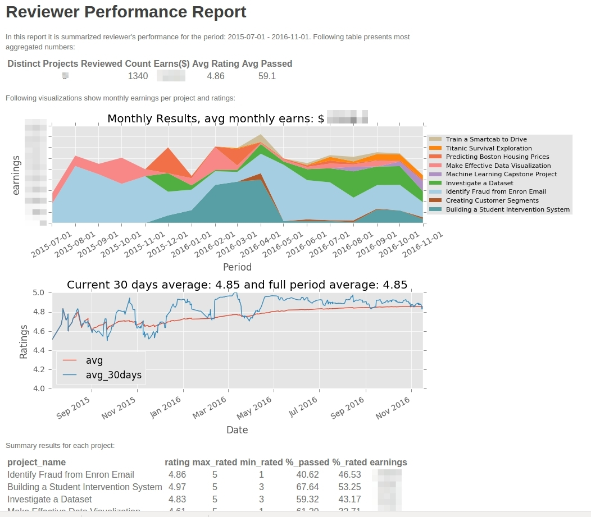

# Usage
Python 2.X version and ```request``` module. ```requirements.txt``` includes other dependencies.
```
usage: grading-assigner.py [-h] [--auth-token TOKEN] [--debug]
                           [--certification]
                           [--ids IDS_QUEUED [IDS_QUEUED ...]]

Poll the Udacity reviews API to claim projects to review.

optional arguments:
  -h, --help            show this help message and exit
  --auth-token TOKEN, -T TOKEN
                        Your Udacity auth token. To obtain, login to
                        review.udacity.com, open the Javascript console, and
                        copy the output of
                        `JSON.parse(localStorage.currentUser).token`. This can
                        also be stored in the environment variable
                        UDACITY_AUTH_TOKEN.
  --debug, -d           Turn on debug statements.
  --certification, -c   Retrieve current certifications.
  --ids IDS_QUEUED [IDS_QUEUED ...], -ids IDS_QUEUED [IDS_QUEUED ...]
                        projects ids to queue separated by spaces, i.e.: -ids 28 38 139
  --stats, -stats       Retrieve stats for all projects


```

# Example
```
python grading_assigment.py -ids 107 104 147
|2016-10-18 10:23:04,097| Requesting certifications...
|2016-10-18 10:23:05,334| Found certifications for project IDs: [104, 106, 108, 147, 234, 105, 236, 235, 107, 28, 27, 103] in languages [u'es', u'en']
|2016-10-18 10:23:05,334| Polling for new submissions...


Selected projects to queue:

                       name                        |  id   | price |     status      |                      hashtag                      
Building a Student Intervention System             |  104  | 45.0  |    certified    | nanodegree,machinelearning                        
Titanic Survival Exploration                       |  147  |  7.0  |    certified    | nanodegree,machinelearning                        
Investigate a Dataset                              |  107  | 50.0  |    certified    | nanodegree,dataanalysis                           


|2016-10-18 10:23:05,335| Will poll for projects/languages [{'project_id': 104, 'language': u'es'}, {'project_id': 104, 'language': u'en'}, {'project_id': 147, 'language': u'es'}, {'project_id': 147, 'language': u'en'}, {'project_id': 107, 'language': u'es'}, {'project_id': 107, 'language': u'en'}]
|2016-10-18 10:23:06,348| Waiting for assigned submissions < 2
```

Press ctrl-c to quit.

# Report example:



